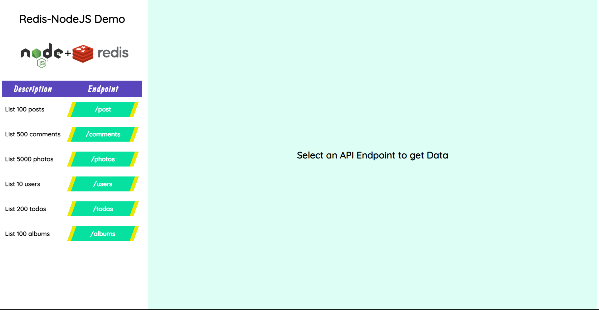
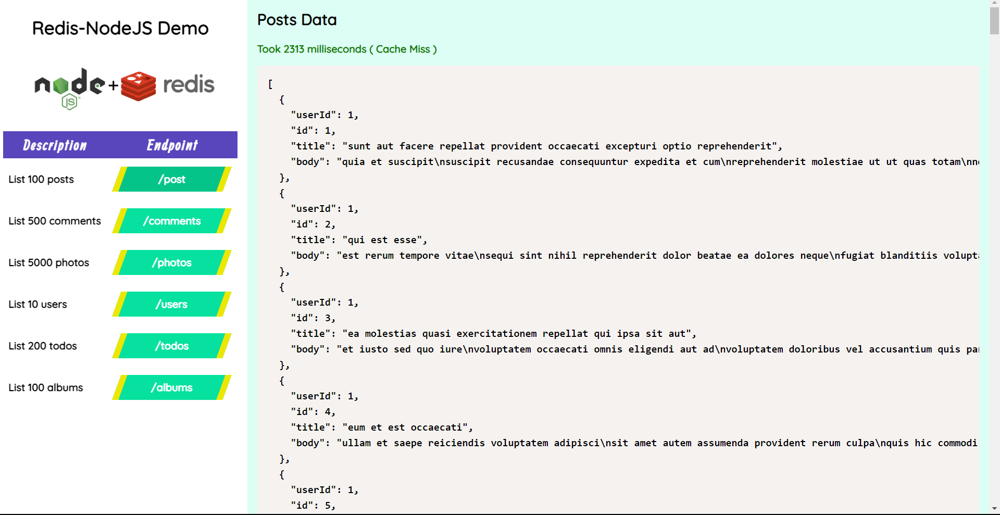
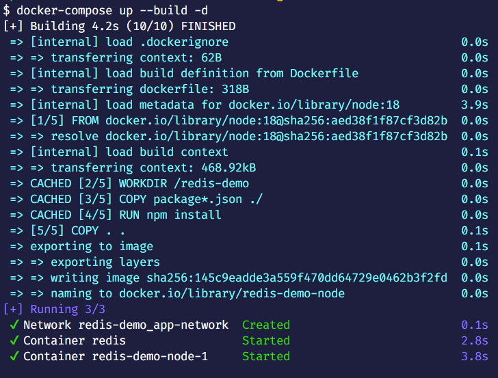
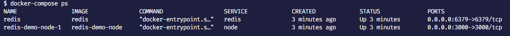
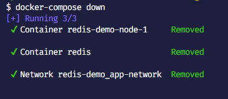

# Title - Caching Data using Redis

This project is demo of caching data using Redis.
Shows user a list of APIs to call, and then caches the response of the API in Redis. On subsequent calls, the cached response is returned. This helps in reducing the response time of the subsequent API calls.

Following is the demo images of the project:

1. Home Page

2. API Response (On Cache Miss)

3. API Response (On Cache Hit)

## Installation

To run the project locally first Clone the repository and then you can run them locally or as a docker container.

### Running Locally
Make sure you have Nodejs and npm installed on your machine.

Step - 1: Install Redis on your machine. You can follow the steps given [here](https://redis.io/docs/getting-started/)

Step - 2: Start Redis Server using the command `redis-server`. You can check the status of the server using the command `redis-cli ping` from another wsl terminal. To interact with redis, you can use the command `redis-cli`

(If you are on windows, run using WSL [Click here to know more](https://redis.io/docs/getting-started/installation/install-redis-on-windows/))

Step - 3: Install the dependencies using the command `npm install`

Step - 4: Run the project using the command `npm start`

### Running as a Docker Container
Make sure you have Docker installed on your machine.

Step - 1: Start Docker Desktop

Step - 2: In the current project folder, Run the command in the terminal `docker-compose up --build -d`

Check status of the container using `docker-compose ps` command

Step - 3: Open the browser and go to `http://localhost:3000/` or `http://127.0.0.1:3000/`

Step - 4: You can see output logs in docker desktop 

To stop the container, run the command `docker-compose down`

